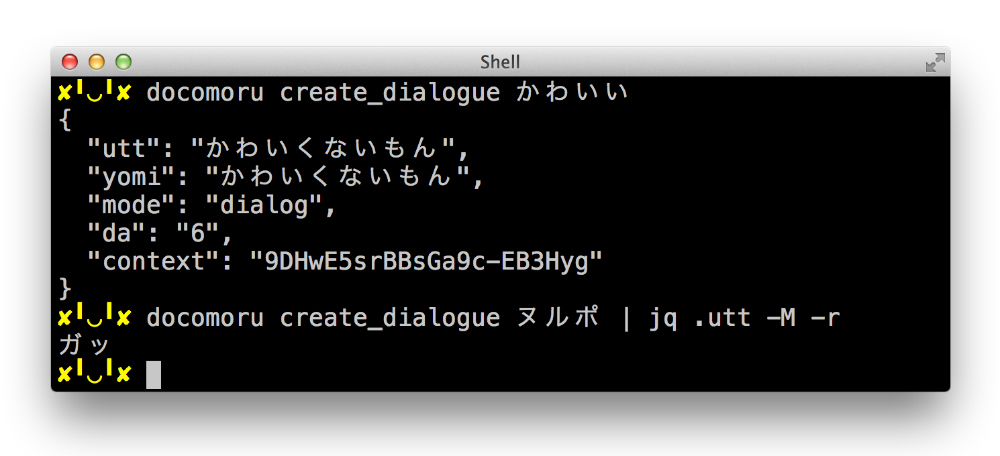

# Docomoru [](https://travis-ci.org/r7kamura/docomoru) [](https://codeclimate.com/github/r7kamura/docomoru) [](https://codeclimate.com/github/r7kamura/docomoru)
Client library for docomo API written in Ruby.

## Install
docomoru can be installed from [rubygems.org](https://rubygems.org/gems/docomoru) as a gem.

```sh
gem install docomoru
```

## Authentication
To use docomo API via docomoru, you need to get docomo API Key.

1. Sign-in to https://dev.smt.docomo.ne.jp/
2. Register new application
3. Generate API Key

## Supported APIs
Currently docomoru is supporting the following APIs.

- [Dialogue API](https://dev.smt.docomo.ne.jp/?p=docs.api.page&api_docs_id=3)
- [Knowledge Q&A API](https://dev.smt.docomo.ne.jp/?p=docs.api.page&api_docs_id=6).

## Usage
You can use docomoru as a library on Ruby code or an executable on CLI.

### Library
Create an instance of `Docomoru::Client`,
then call a method to send an HTTP request to docomo API.
Each method returns `Docomoru::Response` that has status code, headers, and body values.

Here is an example code to use Dialogue API via docomoru.
As you can see, `Docomoru::Client` provides low-level interface of HTTP,
so you may need some wrapper class to use it from your application.

```rb
client = Docomoru::Client.new(api_key: ENV["DOCOMO_API_KEY"])
response = client.create_dialogue("Gemつくりました")
response.status #=> 200
response.headers #=> {
  "Asyncserviceinvoke" => "false",
  "Content-Type"       => "application/json;charset=UTF-8",
  "Date"               => "Fri, 05 Dec 2014 15:10:11 GMT",
  "Content-Length"     => "165",
  "Connection"         => "Close"
}
response.body #=> {
  "utt"     => "gemに登録されるのでしょうかね",
  "yomi"    => "gemに登録されるのでしょうかね",
  "mode"    => "dialog",
  "da"      => "12",
  "context" => "dXIgT9u1_XKfO1QbaVkAGQ"
}
```

## CLI
`docomoru` executable is bundled to call docomo API from CLI.
This executable handily creates an instance of `Docomoru::Client` with given API Key,
then call the specified method, and returns its response.

```
$ docomoru <method> <arguments> [options]
              |          |          |
              |          |          `-- -a, --api-key (or use DOCOMO_API_KEY env)
              |          |              -h, --help
              |          |                  --header
              |          |                  --no-body
              |          |
              |          `------------- required arguments for the method
              |
              `------------------------ method name

$ docomoru create_dialogue かわいい
$ docomoru create_knowledge Rubyの作者は誰ですか
```


